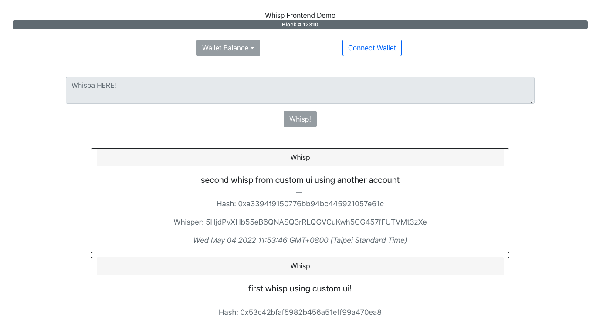
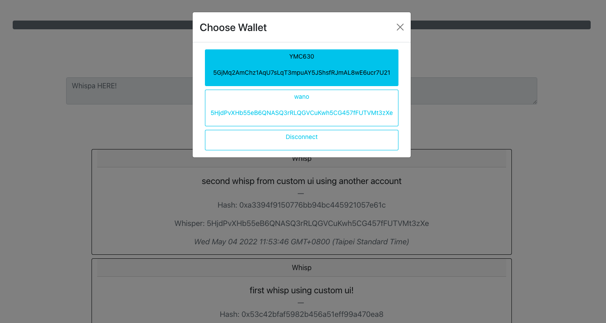
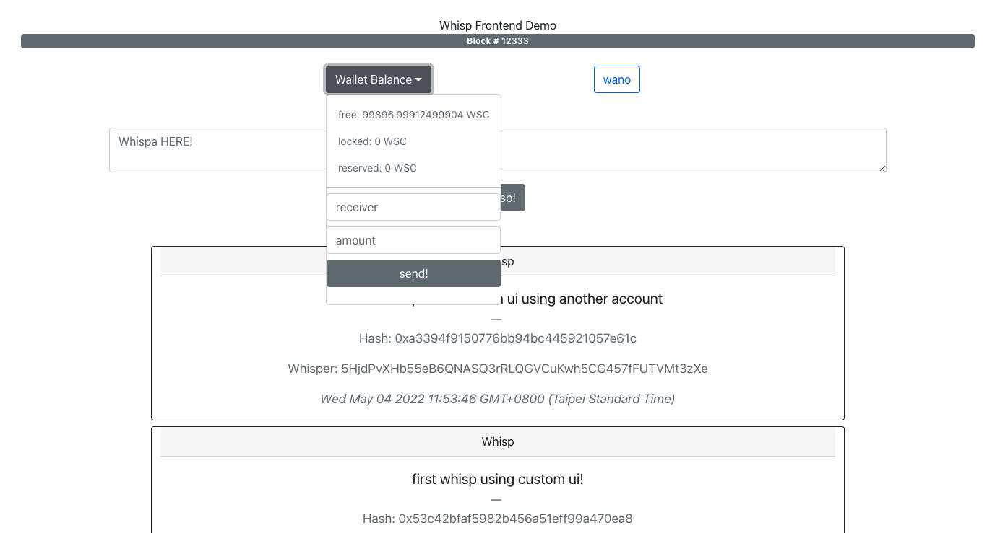
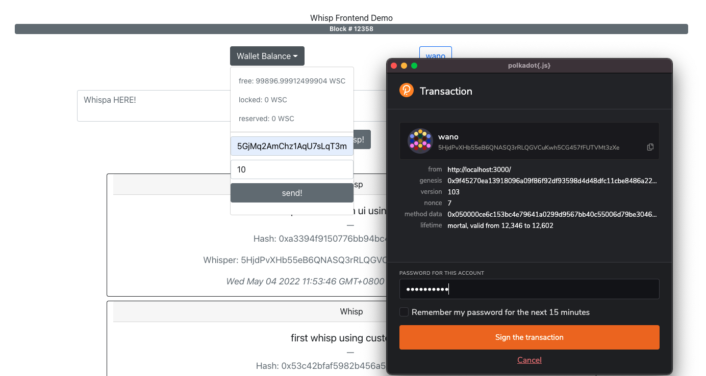
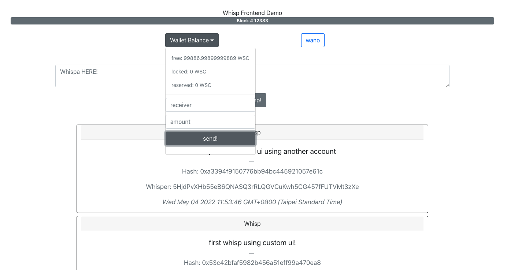
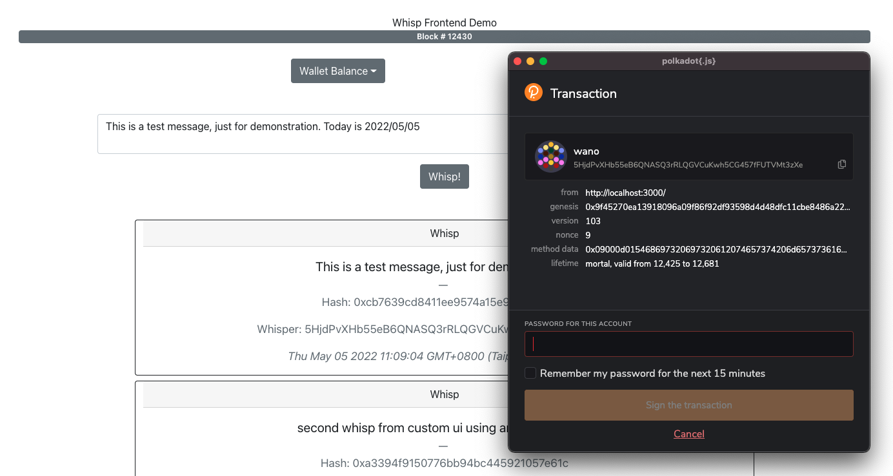
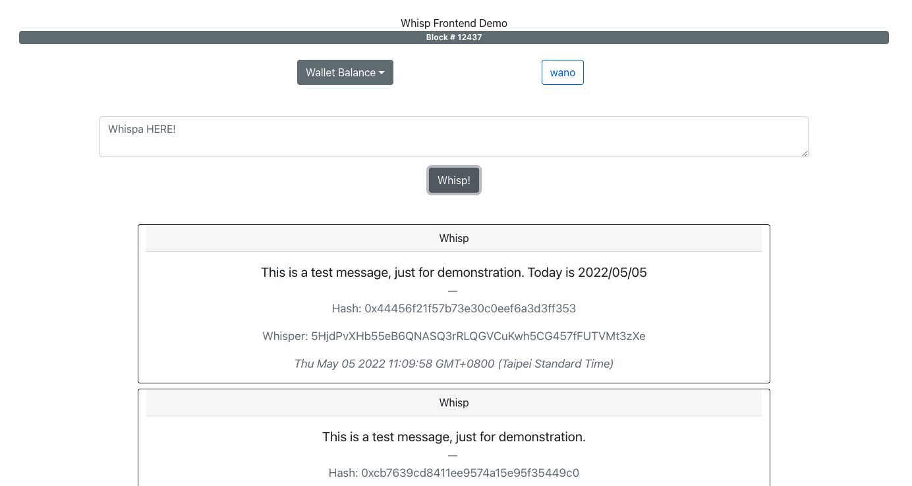
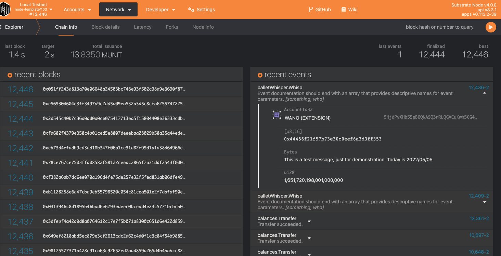
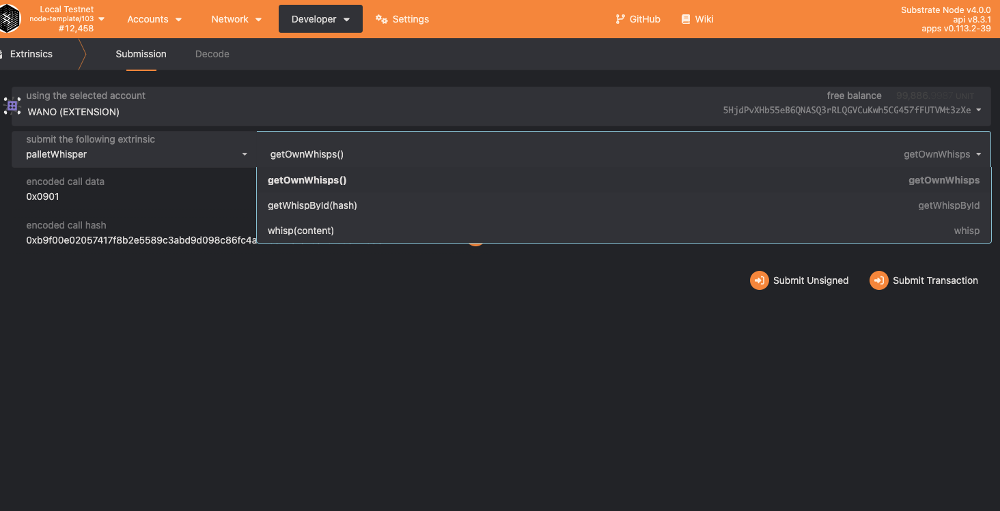

# Substrate Blockchain Demo - Whispa

This project was bootstrapped with [Create React App](https://github.com/facebook/create-react-app).

The project is a custom frontend for the substrate blockchain demonstration. 
[Backend repo can be found here](https://github.com/yumingchangsabodota/whispa-demo-backend)

This project tries to demo the possibility of twitter on blockchain using substrate.
Substrate is a blockchain framework developed by Parity tech written in Rust. 
[More details on substrate can be found here](https://substrate.io/)

Once connected to a wallet, user can "whisp" to the chain, and the message will be stored in the blockchain.
More features can be implemented such as re-whisp, likes, dislikes etc. 
This chain dose not necessary require hardfork when adding new fetures thanks to the onchain upgrade feature comes with substrate.

## Here are some screenshots of the frontend demo

Initiate state of the frontend, which queries all whisps and listen to blocks.

Click connect wallet button and a popup will show the injected wallets from polkadot.js extension.

Once wallet is connected, the wallet balance will show.

We can send a transaction through this custom ui. When click `Send!` polkadot.js will popup a sign window.
Sign and submeit the transaction.

We can see the balance difference after transaction is sent.

After connecting the wallet, we are able to whisp.
Now let's whisp.
Just like sending transaction, we will need to sign the whisp.

Once whisp is sent, the new whisp will appear in ui.

On the blockchain explorer we can see the whisp event.

There are some other functions that can be called from the `whisp-pallet`.

